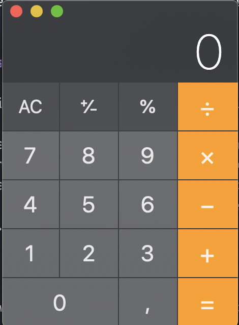

# My React Calculator

**[EN]**
> This project has been taken from [App Ideas](https://github.com/florinpop17/app-ideas) repository

# **Calculator**

Calculators are not only one of the most useful tools available, but they are also a great way to understand UI and event processing in an application. In this problem you will create a calculator that supports basic arithmetic calculations on integers.

The styling is up to you so use your imagination and get creative! You might also find it worth your time to experiment with the calculator app on your mobile device to better understand basic functionality and edge cases.

### **Constraints**

- You may not use the `eval()` function to execute calculations

## **Features**

- [x]  User can see a display showing the current number entered or the result of the last operation.
- [x]  User can see an entry pad containing buttons for the digits 0-9, operations - '+', '-', '/', and '=', a 'C' button (for clear), and an 'AC' button (for clear all).
- [x]  User can enter numbers as sequences up to 8 digits long by clicking on digits in the entry pad. Entry of any digits more than 8 will be ignored.
- [x]  User can click on an operation button to display the result of that operation on:
- [x]  User can click the 'C' button to clear the last number or the last operation. If the users last entry was an operation the display will be updated to the value that preceded it.
- [x]  User can click the 'AC' button to clear all internal work areas and to set the display to 0.
- [ ]  User can see 'ERR' displayed if any operation would exceed the 8 digit maximum.

## **Bonus features**

- [x]  User can click a '+/-' button to change the sign of the number that is currently displayed.
- [x]  User can see a decimal point ('.') button on the entry pad to that allows floating point numbers.

## Observation

Calculator design was inspired by Apple MacOS calculator

---

**[PT-BR]**

# **Calculadora**

As calculadoras não são apenas uma das ferramentas mais úteis disponíveis, mas também são uma ótima maneira de entender o processamento de UI e eventos em um aplicativo. Nesse problema, você criará uma calculadora que suporta cálculos aritméticos básicos em números inteiros.

O estilo é com você, então use sua imaginação e seja criativo! Também vale a pena experimentar o aplicativo da calculadora em seu dispositivo móvel para entender melhor a funcionalidade básica e os casos extremos.

### **Restrições**

- Você não pode usar a função `eval ()` para executar cálculos

## **Funcionalidades**

- [x] O usuário pode ver uma tela mostrando o número atual digitado ou o resultado da última operação.
- [x] O usuário pode ver um painel de entrada contendo botões para os dígitos de 0 a 9, operações - '+', '-', '/' e '=', um botão 'C' (para limpar) e um Botão 'AC' (para limpar tudo).
- [x] O usuário pode inserir números como sequências de até 8 dígitos, clicando nos dígitos no painel de entrada. A entrada de qualquer dígito acima de 8 será ignorada.
- [x] O usuário pode clicar em um botão de operação para exibir o resultado dessa operação em:
- [x] O usuário pode clicar no botão 'C' para limpar o último número ou a última operação. Se a última entrada do usuário foi uma operação, a exibição será atualizada para o valor que a precedeu.
- [x] O usuário pode clicar no botão 'CA' para limpar todas as áreas de trabalho internas e ajustar a exibição para 0.
- [] O usuário pode ver 'ERR' exibido se qualquer operação exceder o máximo de 8 dígitos.

## **Recursos bônus**

- [x] O usuário pode clicar no botão '+/-' para alterar o sinal do número exibido no momento.
- [x] O usuário pode ver um botão de ponto decimal ('.') no teclado de entrada para permitir números de ponto flutuante.

## Observação

O Design da calculadora foi baseado na calculadora do Apple MacOS

